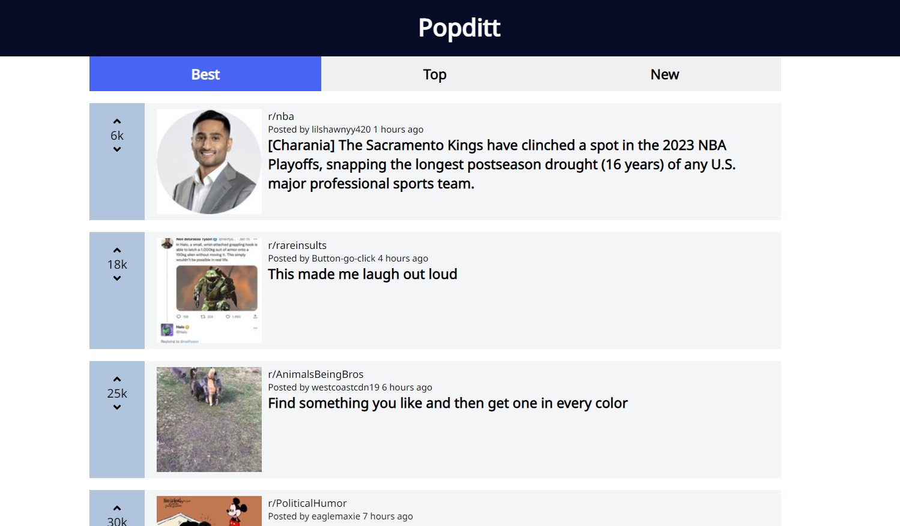

# Popditt
> Responsive reddit clone made using TypeScript with React, Redux.
> Live demo [_here_](https://popditt.filippopendyk.com/). <!-- If you have the project hosted somewhere, include the link here. -->

## Table of Contents
- [Popditt](#popditt)
  - [Table of Contents](#table-of-contents)
  - [General Information](#general-information)
  - [Technologies Used](#technologies-used)
  - [Features](#features)
  - [Screenshots](#screenshots)
  - [Setup](#setup)
  - [Project Status](#project-status)
  - [Room for Improvement](#room-for-improvement)
  - [Acknowledgements](#acknowledgements)
  - [Contact](#contact)
<!-- * [License](#license) -->


## General Information
- Firstly the purpose of making the project, was getting comfortable working with build tool like Vite, ands its envinroment. Secondly, i wanted to practice my TypeScript, React, Redux and Unit Testing skills.
<!-- You don't have to answer all the questions - just the ones relevant to your project. -->


## Technologies Used
- Vite
- TypeScript
- React
- Redux
- CSS
- React Testing Library
- Jest
- Reddit API

## Features
List the ready features here:
- Top reddit categories.
- Posts from reddit category.
- Page for selected post.


## Screenshots



## Setup
1. Clone project from repository.
2. Open your project in terminal.
3. Install all packages with
   ```
   npm install
   ```
4. Launch the dev server with
    ```
    npm run dev
    ```
5. Access the app at your browser.
6. (Optional) If you want to launch test - use this alias in your terminal.
    ```
    npm run test
    ```

## Project Status
Project is:  _complete_.


## Room for Improvement

Room for improvement:
- Single post page.

To do:
- Comment feature.


## Acknowledgements
Give credit here.
- This project was inspired by reddit.


## Contact
Created by [@filippopendyk](https://www.filippopendyk.com/) - feel free to contact me!